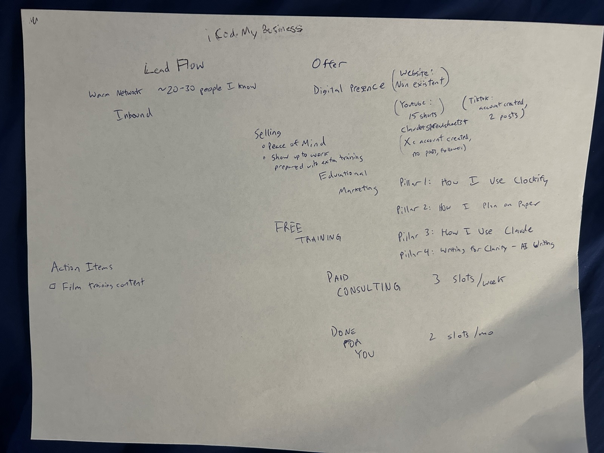

# The iCodeMyBusiness offer

The one source for what Matthew sells, reconciled from three places he described
it: his paper plan (photo below), his Fathom calls from 2026-08-18 to 09-02, and
his own messages in this repo's session transcripts. Every claim carries its
source. Where the three disagree, that is recorded rather than smoothed over.

**Owner:** Matthew. Agents may propose edits here; only he asserts facts about the
business (`docs/copy-principles.md` §2). **Last reconciled:** 2026-09-04.

The live homepage letter reads its copy from `src/content/landing.ts`; that file
should follow this one, not the other way round.

---

## One line

Peace of mind, and showing up to work more prepared than usual. Free training
brings people in, an assessment finds the one thing costing them the most, and a
free intro call routes them into paid consulting or done-for-you work.

*[paper plan; X-engine goal, transcript 2026-09-02]*

---

## The ladder

The paper plan is a three-rung value ladder. The rate card and the live site each
cut it differently.

| Rung | Paper plan | Capacity (paper) | Rate card, March 2026 | Live site, Sept 2026 |
|---|---|---|---|---|
| Free | Free training, four pillars | open | discovery call, audits, blueprints | discovery assessment + 15-min Introduction Call |
| Middle | Paid consulting | 3 slots / week | $50, $100, $200 per hour | **no path** |
| Top | Done for you | 2 slots / month | builds $5k–$50k+, 2–12 wks; packages $3.5k–$5k/mo | three routes: have it built / bring me inside / rebuild how it runs |

The rate card is `offers/consulting.md` and is internal only. **No price appears
on any served page** (standing decision 2026-09-02, roadmap R-009).

---

## How a stranger becomes a client

1. **Educational marketing across four pillars** — How I Use Clockify, How I Plan
   on Paper, How I Use Claude, Writing for Clarity. YouTube shorts and long-form,
   each with a blog post. *[paper; transcripts 09-01]*
2. **Lead flow is two-track** — a warm network of roughly 20–30 people, plus
   inbound from that content. Digital presence on paper was near zero: website
   non-existent at the time, 15 YouTube shorts, 2 TikTok posts, X with no posts.
   *[paper]*
3. **The site's single next action is the discovery assessment.** Five questions
   in the visitor's own words: biggest frustration, what it costs, how long, if
   nothing changes, the outcome. It finds the one thing to fix first and produces
   a write-up. Matthew's framing: *"If it's not working, we don't want to
   automate it. We start by thoroughly assessing your current situation."*
   *[transcripts 09-04; `src/content/discovery-questions.ts`]*
4. **Every path lands on the free Introduction Call.** The more they tell the
   assessment, the more context Matthew brings. By the time the offer lands they
   should already be sold on who he is from how the paths are laid out.
   *[transcripts 09-02, 09-04]*
5. **Follow-up happens in the inbox** — see "Value in your inbox" below. Today
   that is the write-up email after the assessment; the nurture sequence is
   decided and being built, not live. *[transcript 09-04]*

---

## Value in your inbox — how a lead stays warm

Most people who finish the assessment are not ready to buy that week. The inbox
is where the offer is delivered over time, and where the free rung actually
happens for the majority who never book. Matthew's reason, on the Aaron call:
*"I personally bought things that are high-ticket items just because someone
stayed in my inbox and I just kept reading that email."* And on what delivery
looks like from the client's side: *"next week we roll out updates, and then
boom — hey guys, we're in your inbox still."* His instruction on 09-04: *"we need
to keep the leads warm!"* — email sequencing is part of the value delivery
system, not a marketing add-on. *[Fathom 08-24 at 20:04 and 40:30; transcript 09-04]*

Every line below carries one of four labels. Only **live** may be repeated on a
visitor surface.

**Live** *(verified in code, 09-04)*

- `/free-tools` capture → welcome email with the download links. Audited in
  `emailSends` (template `welcome`).
- Assessment submit → the write-up email: their five answers back in their own
  words, the recommended path, one thing to do this week, the booking link, and
  "reply — a real person reads every message". Audited (`discovery-report`). A
  degraded variant sends the raw answers when the model is down.
- Calendly booking confirmation, e-commerce intake follow-up, and an internal
  roadmap alert to Matthew — sent, not audited.
- Captures on `/academy`, `/mango`, `/services` create a lead and send **nothing**.
- **Nothing sends a second email to anyone.** Every scheduled call is immediate;
  there is no email cron.

**Decided by Matthew** *(email-followup session, 09-04)*

- The sequence engine lives in Convex.
- The deliverable is an HTML report to the lead plus an internal brief to
  matthew@ — not the workbook or slide deck floated earlier the same day (#6 below).
- Cadence: the day-0 report, then daily for four days, then weekly.
- Assessment submit is the first entry point; free-tools, academy and post-call
  come later.
- A consent line and `leads.consentedAt` ship **before** any sequence sends;
  addresses captured before that are held out permanently.

**Being built** *(email-followup, branch `agent/nurture/email-sequence`; reported,
not independently verified)*

- The DotCom Secrets Soap Opera shape: the day-0 report is email #1 (welcome,
  expectations, first open loop); days 1–4 are backstory → epiphany → hidden
  benefits → call to action, branching on the recommended path and quoting the
  visitor's *recorded* words. Never described as "AI-personalised".
- Schema, sweeper, suppression list and one-click unsubscribe are written but not
  gate-green; it ships paused with zero enrollments. Roadmap R-022.

**Open — Matthew's to answer**

- Days 1–2 are his backstory and epiphany; an agent may not write them
  (copy-principles §2). `docs/matthew-story-intake.md` on that branch is unanswered.
- What the weekly email contains after day 5, and who writes it.
- Whether `/free-tools` and `/academy` captures enroll, and what their consent
  line says.

**Rules for anyone writing about this** (CMO board, letter, promises workbook)

- Do not say the sequence exists, and do not promise a cadence on any visitor
  surface, until it sends from prod.
- No urgency, scarcity or capacity language in the sequence — there is no real
  deadline in the repo, and *"I hold very few of these at once"* is already
  flagged (#2 below).
- Do not say "AI". The personalisation is the visitor's own words.

---

## What the paid work looks like

From deals closed or negotiated in the last two weeks, not from site copy.

- **A defined build.** $40k certification platform, 4–6 weeks, $20k up front. The
  lesson from the Otto coaching call, which Matthew agreed with: over-deliver on
  the first, then reset the standard to 6–8 weeks so the client never assumes the
  sprint is normal. *[Fathom 08-19, 08-26]*
- **Ongoing.** A $3k–$7k/mo retainer to maintain what was built, priced by named
  roles and responsibilities, never a broad "we do everything" scope — the exact
  trap the client's previous $30k/mo vendor fell into. Separate build projects
  from operational support. *[Fathom 08-25]*
- **Position on done-for-you**, argued against Aaron Figueroa: keep it as the top
  tier. *"The best customers, because they have money and they just want the
  thing done."* It scales once systematized and delegated. *[Fathom 08-24]*
- **Delivery promise.** Weekly video walkthroughs of what changed; the client owns
  it outright. Speed of iteration is the differentiator. *[transcripts 09-02;
  Fathom 08-26]*
- **Matthew's own 90-day picture**, in his words to the assessment: a high-ticket
  program where people pay to be in the community and get trained on running a
  business with clear thinking, software and AI tools. $50k/mo and up.
  *[transcript 09-04]*

---

## Where the sources disagree

| # | Disagreement | Status |
|---|---|---|
| 1 | **Program capacity.** Site said "a handful a year". | **Resolved 09-04** — Matthew's wording: *"A few slots available per year."* Live in `da28c3c`. |
| 2 | **Fractional capacity.** Site says *"capacity-limited — I hold very few of these at once."* Paper says done-for-you is 2 slots/month. | **Open.** Agent-authored; needs Matthew's number or wording. |
| 3 | **The middle rung has no door.** Paid consulting is on paper (3/week) and on the rate card, but the site's four routes are one free diagnosis and three done-for-you shapes. | **Open.** Decide whether consulting gets a path. |
| 4 | **Three tiers vs four paths.** The site split the single done-for-you rung into build / fractional / program. | **Open.** Decide which is canonical. |
| 5 | **Prices.** Rate card has them (March); site deliberately doesn't. Fathom deals run 2–8× the rate-card package figures. | Consistent with the no-price decision. Rate card is stale. |
| 6 | **The follow-up deliverable.** Transcript 09-04, morning: *"an excel workbook … or a slide deck"*. Same day, asked directly: HTML report to the lead + brief to Matthew. | **Resolved 09-04** — the HTML report. A workbook or deck needs dependencies the stack doesn't have. |

---

## Sources

- **Paper plan** — photographed 2026-09-04, `docs/offer-paper-plan-2026-09.jpg`.
- **Fathom** — 08-18/19 Jason Learning proposal and kickoff (174413538, 174930687);
  08-24 Aaron Figueroa (176305020); 08-25 Jason Learning retainer (176758172);
  08-26 Otto Petersen coaching (177211751).
- **Session transcripts** — `~/.claude/projects/-Users-matthewkerns-workspace-agency-operations-icodemybusiness-site/*.jsonl`,
  Matthew's user messages 2026-09-01 → 09-04.
- **email-followup session** — Matthew's answers on 09-04 (engine, deliverable,
  cadence, entry point, consent); build status as that session reported it.
  Framework: DotCom Secrets §7–8 notes at
  `~/workspace/ecommerce/ecommerce-tools/fulfillment-logistics/inventoryhero-marketing-frontend/docs/funnel-audit/dotcom-secrets-framework-notes.md`.
- **Written** — `offers/consulting.md`, `offers/free-offers.md`,
  `offers/info-products.md`, `content/README.md`,
  `skill-packages/ecommerce-brand-automation-audit/ecommerce-intake/references/5-questions-framework.md`.

## How to change this

Edit this file, then bring `src/content/landing.ts` into line with it, then
republish the living view: https://claude.ai/code/artifact/0e0b27a8-5af0-4991-9905-db82a8d21f81
(same artifact URL every time; it is this file rendered, not a second source). The
content tests (`src/content/__tests__/landing.test.ts`) enforce the standing
constraints — no price amounts, no hardcoded call durations, no
reassurance-shaped copy, every path keeping its commitment line.
